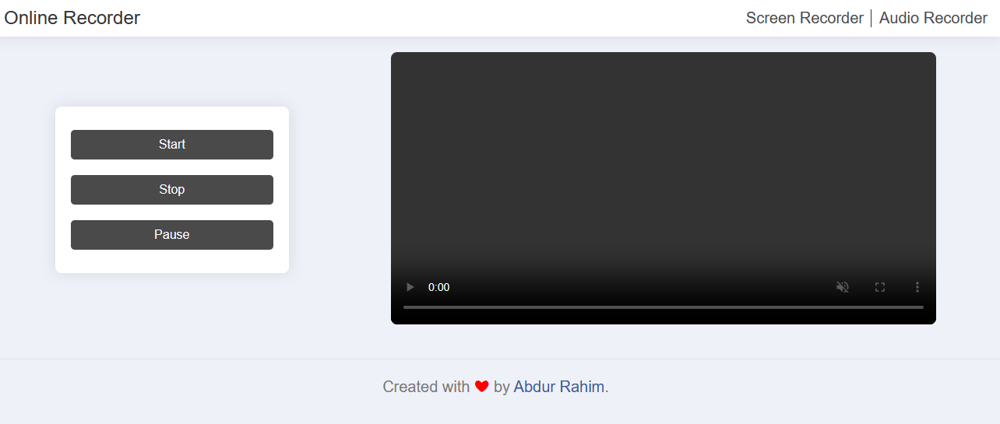
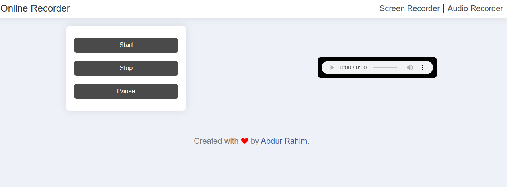
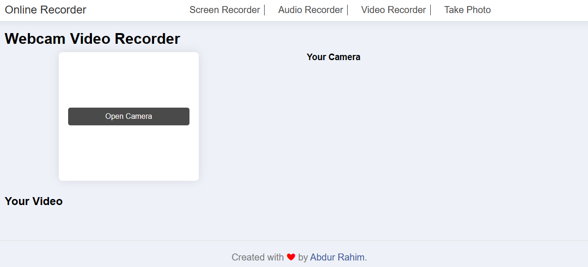
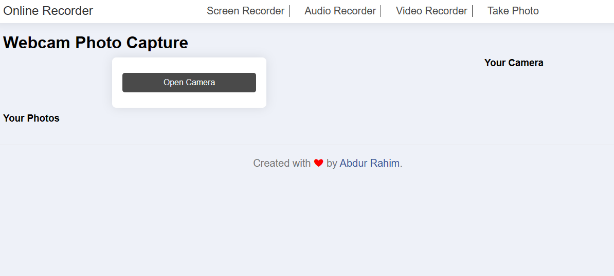

# Simple Online Recorder 
## Description  
This is a simple online recorder. It can record audio and screen record and you can save it to your device. It can also play the recorded audio and screen record. 
## Features
- Record audio
- Record screen
- Play audio
- Play screen record
- Download audio
- Download screen record
- Webcam Video record
- Webcam Video play
- Download webcam video
- webcam image capture 
- Download webcam image

## How to use
- **Record audio**: Click the the `"Start"` button to start recording. Click the `"Stop"` button to stop recording. Click the `"Pause"` button to pause audio and showing resume again Click "Resume" then continue to record,  Click the "Download" button to save the recording to your device.
- **Record screen**: Click the the `"Start"` button to start recording. Click the `"Stop"` button to stop recording. Click the `"Pause"` button to pause screen record and showing resume again Click "Resume" then continue to record,  Click the "Download" button to save the recording to your device.

- **Play audio**: Click the `"Play"` button to play the audio. Click the `"Pause"` button to pause the audio. Click the `"Stop"` button to stop the audio.
- **Play screen record**: Click the `"Play"` button to play the screen record. Click the `"Pause"` button to pause the screen record. Click the `"Stop"` button to stop the screen record.  

- **Webcam Video record**: Click the the `"Open Camera"` button to open camera. Click the `"record"` button to record video. Click the `"Pause"` button to pause webcam video and showing resume again Click "Resume" then continue to record,  Click the "Download" button to save the recording to your device.


- **Webcam image capture**: Click the the `"Open Camera"` button to open camera. Click the `"Capture"` button to capture image. Click the `"Download"` button to save the image to your device.

## Tech Stack 
- HTML
- CSS
- Vanila JavaScript

## Installation to Local
- Clone the repository
```bash
git clone https://github.com/AbdurRaahimm/Online-Recorder.git
```
- Open the `index.html` file in your browser 


## Screenshort 





## Demo
[Live Demo](https://abdurraahimm.github.io/Online-Recorder/)


## Contribute 
if you want to contribute then follow step -
- Fork the repository
- Create issue what you want to add or modify
- Clone your local pc 
- Do the desired changes 
- Make a pull request
- Wait for approval


## Author
- [Twitter](https://twitter.com/AbdurRahim4G)
- [Instagram](https://www.instagram.com/abdurrahim4g/)
- [Facebook](https://www.facebook.com/Rahim72446)
- [LinkedIn](https://www.linkedin.com/in/abdur-rahim4g/)
- [YouTube](https://youtube.com/@AbdurRahimm)
